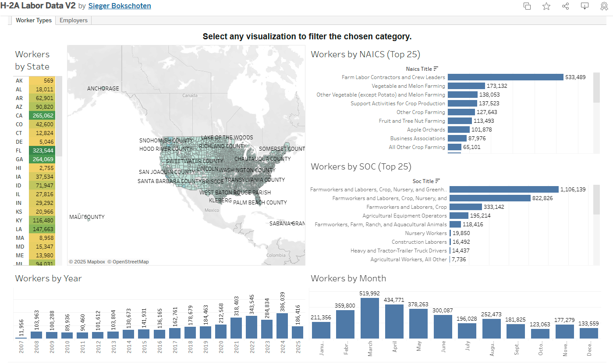

# H-2A Labor Data
### Normalized, and Combined Employment Data for H-2A Workers in the United States
 

## Visualizations
Visualized data is available for exploration on Tableau Public. [Tableau Public Sieger.Bokschoten](https://public.tableau.com/app/profile/sieger.bokschoten/viz/H-2ALaborDataV2/WorkerTypes)
 

## Purpose
This repository is intended to provide a single source for all H-2A employment data in the United States, and to make it easier to compare years together by normalizing the data. This data is intended for anyone interested in doing their own analysis using specialized software, or programs like Excel.

Modifications to the data will be limited, and will only be made to correct inconsistencies in data quality. Steps like removing white space around text, or removing obvious typos will be documented in the python code.

When analyzing H-2A data, it can be difficult to compare changes year over year for several reasons:
1. The data is not normalized across all years.
2. The program dates for the DOL go from October 1st, to September 30th. This can create confusion when comparing reported data to calendar years.
3. It's not obvious where to find historical data on the H-2A labor force.
4. Reported data changes by year. Currently, the more recent the reported year, the more data that is included.
5. Duplicated cases can be found in the data.

## Data
All data is provided from the Department of Labor's Performance Data [H-2A Performance Data](https://www.dol.gov/agencies/eta/foreign-labor/performance).

The data included in this repository are from:

[FY2025 Q2](https://www.dol.gov/sites/dolgov/files/ETA/oflc/pdfs/H-2A_Disclosure_Data_FY2025_Q2.xlsx) - 
[FY2024](https://www.dol.gov/sites/dolgov/files/ETA/oflc/pdfs/H-2A_Disclosure_Data_FY2024_Q4.xlsx) - [FY2023](https://www.dol.gov/sites/dolgov/files/ETA/oflc/pdfs/H-2A_Disclosure_Data_FY2023_Q4.xlsx) - [FY2022](https://www.dol.gov/sites/dolgov/files/ETA/oflc/pdfs/H-2A_Disclosure_Data_FY2022_Q4.xlsx) -  [FY2021](https://www.dol.gov/sites/dolgov/files/ETA/oflc/pdfs/H-2A_Disclosure_Data_FY2021.xlsx) - [FY2020](https://www.dol.gov/sites/dolgov/files/ETA/oflc/pdfs/H-2A_Disclosure_Data_FY2020.xlsx)
 
[FY2019](https://www.dol.gov/sites/dolgov/files/ETA/oflc/pdfs/H-2A_Disclosure_Data_FY2019.xlsx) - [FY2018](https://www.dol.gov/sites/dolgov/files/ETA/oflc/pdfs/H-2A_Disclosure_Data_FY2018_EOY.xlsx) - [FY2017](https://www.dol.gov/sites/dolgov/files/ETA/oflc/pdfs/H-2A_Disclosure_Data_FY17.xlsx) - [FY2016](https://www.dol.gov/sites/dolgov/files/ETA/oflc/pdfs/H-2A_Disclosure_Data_FY16_updated.xlsx) - [FY2015](https://www.dol.gov/sites/dolgov/files/ETA/oflc/pdfs/H-2A_Disclosure_Data_FY15_Q4.xlsx) - [FY2014](https://www.dol.gov/sites/dolgov/files/ETA/oflc/pdfs/H-2A_FY14_Q4.xlsx)
 
[FY2013](https://www.dol.gov/sites/dolgov/files/ETA/oflc/pdfs/H2A_FY2013.xls) - [FY2012](https://www.dol.gov/sites/dolgov/files/ETA/oflc/pdfs/H-2A_FY2012.xlsx) - [FY2011](https://www.dol.gov/sites/dolgov/files/ETA/oflc/pdfs/H-2A_FY2011.xlsx) - [FY2010](https://www.dol.gov/sites/dolgov/files/ETA/oflc/pdfs/H-2A_FY2010.xlsx) - [FY2009](https://www.dol.gov/sites/dolgov/files/ETA/oflc/pdfs/H2A_FY2009.xlsx) - [FY2008](https://www.dol.gov/sites/dolgov/files/ETA/oflc/pdfs/H2A_FY2008.xlsx)

Exported data ready for analysis is available for download in the "processed_exports" folder. Data is available in csv, pkl, feather, and parquet formats, download "cleaned_final.xxx" for most up-to-date versions.
Direct links here:
[CSV](https://github.com/sieger1010/h2a/blob/main/processed_exports/cleaned_final.csv), [Pickle](https://github.com/sieger1010/h2a/blob/main/processed_exports/cleaned_final.pkl), [Feather](https://github.com/sieger1010/h2a/blob/main/processed_exports/cleaned_final.feather), [Parquet](https://github.com/sieger1010/h2a/blob/main/processed_exports/cleaned_final.parquet)

## Insights
Data insights will be provided here free for use in the future. All python scripts are being created and tested in the [Spyder IDE](https://www.spyder-ide.org/).

## Dependencies
Python 3.12 or higher. 
xlrs package is used to read Excel files. 
xlrd package is used to read Excel files. 
pandas package is used to manipulate dataframes. 
pyarrow for data exports to feather/parquet.

 

## Discovered Issues
- ~~employment_end_date - dates are not showing up as expected, when data was reviewed in Tableau, found dates from year 3000+.~~
- Duplicate Case Numbers found with differing data. So far it appears this does not affect total number of workers certified, but will require more investigation.
- North Carolina Growers Association is appearing under multiple variations of the same name. This is preventing the correct total of certified workers from being displayed under one name.

### Disclaimer
I make no guarantees about the accuracy of this data, but will do my best to keep it up-to-date and error-free. If you find any errors or have suggestions for improvement, please let me know, or make your own contribution!
